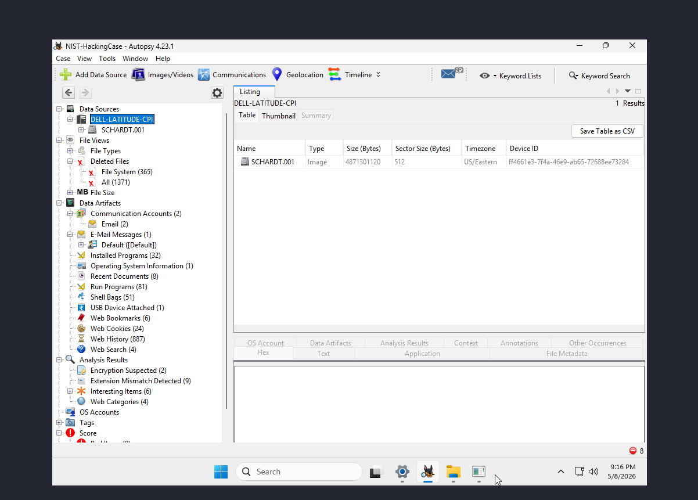
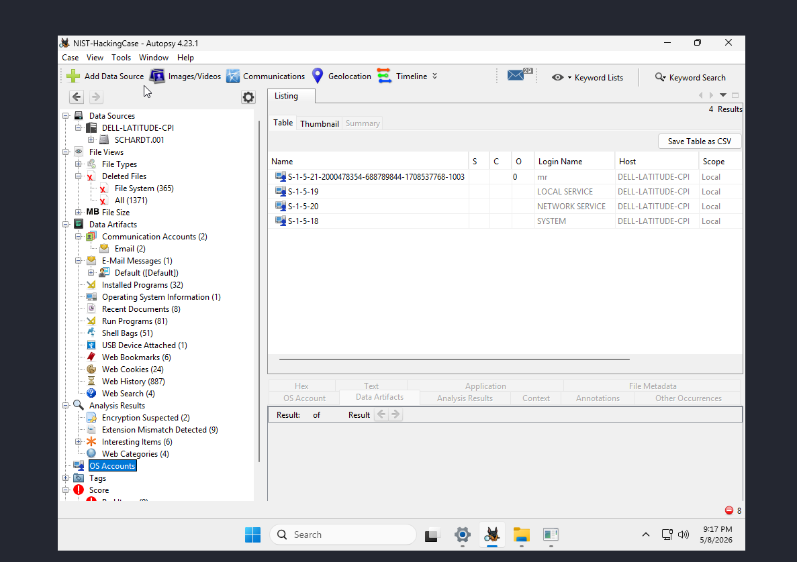
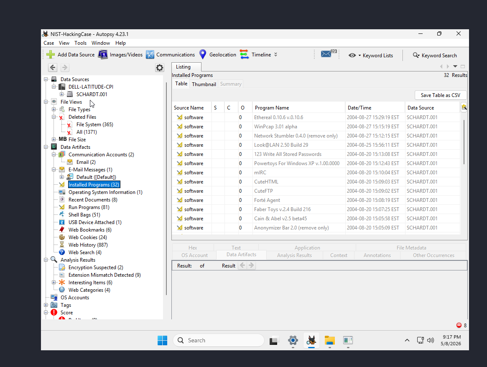
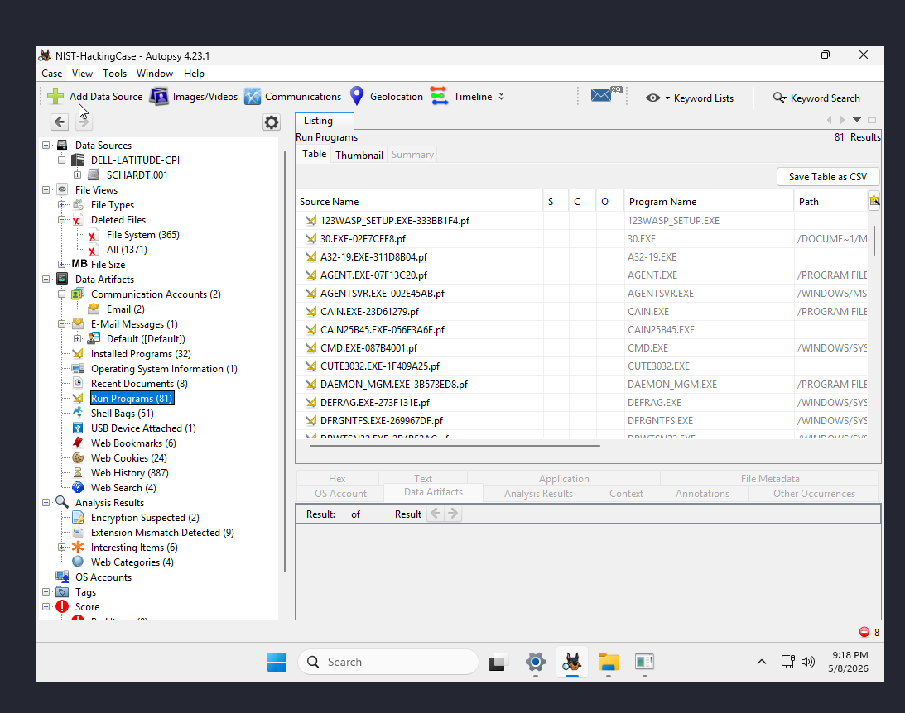
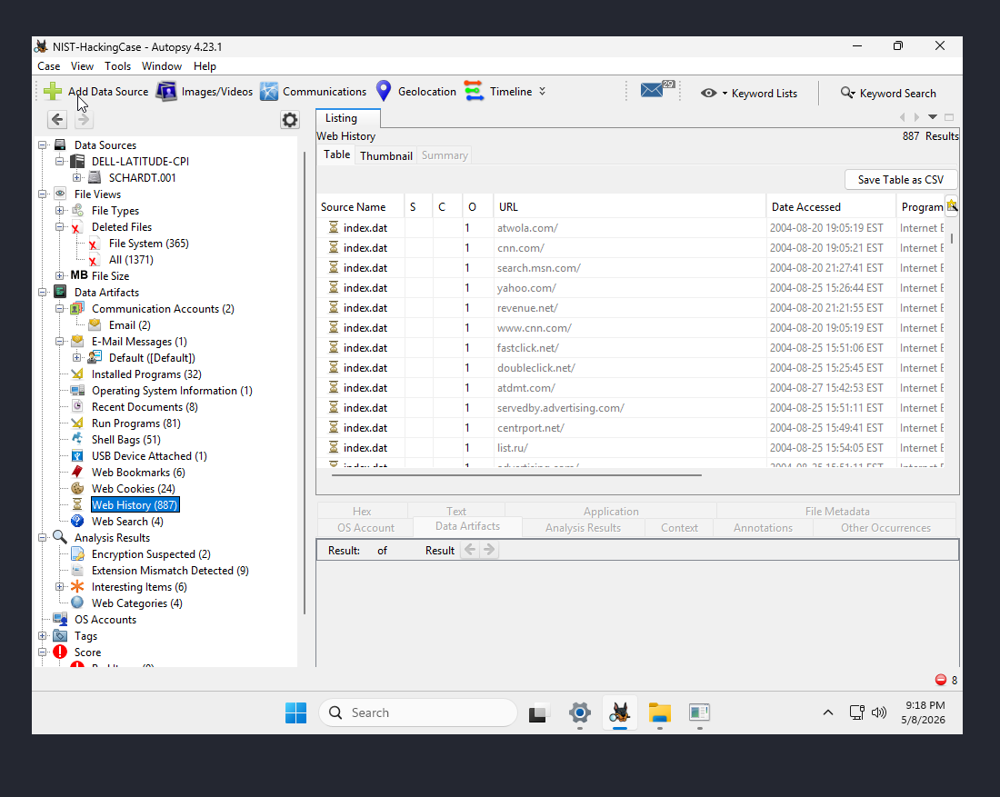
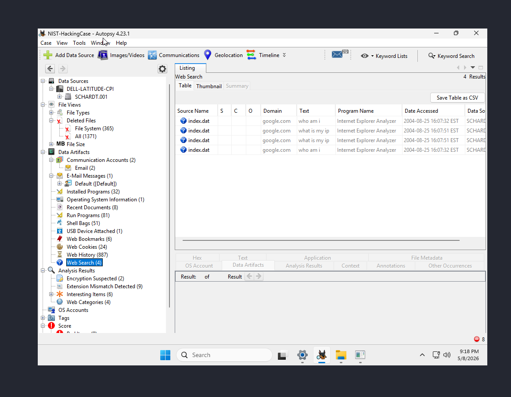
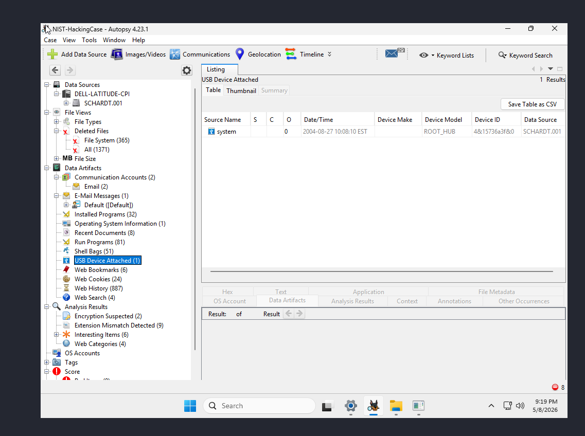
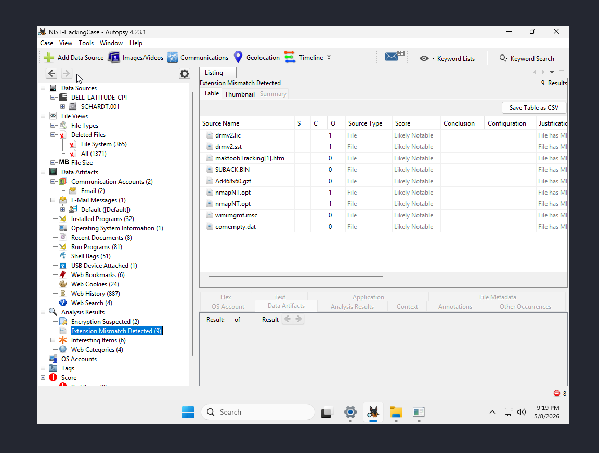
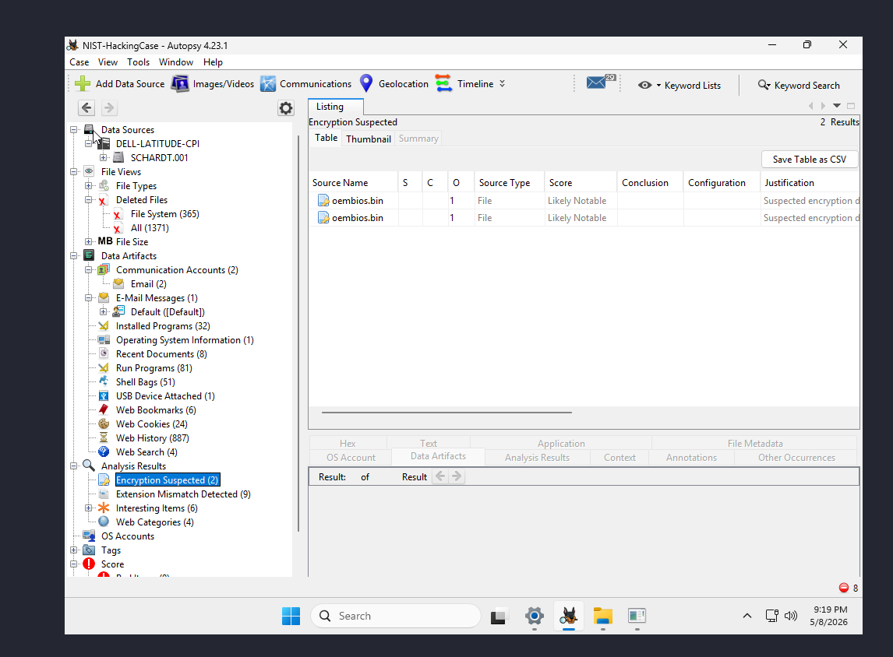
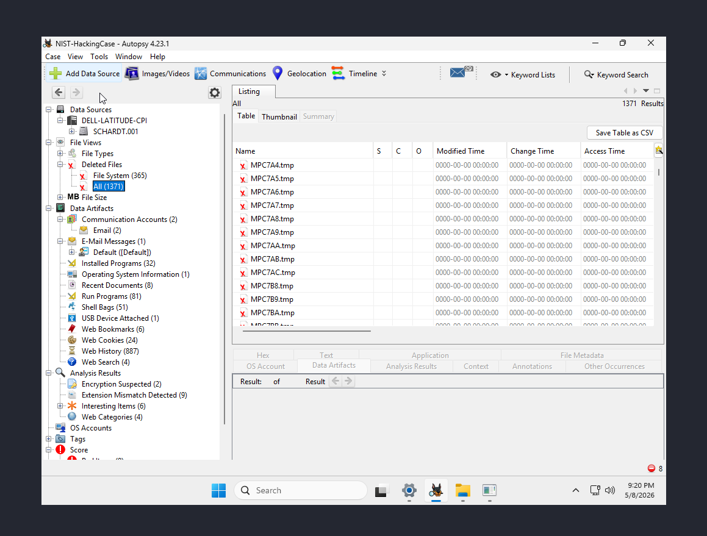

# 🔍 DFIR Lab — NIST Hacking Case (2004)


> **A full digital forensics investigation of a compromised Windows XP system — covering evidence acquisition, hash verification, user attribution, hacking tool analysis, browser forensics, and timeline reconstruction.**

---

## 📁 Repository Structure

```
dfir-nist-hacking-case/
├── README.md                        ← You are here
├── report/
│   └── NIST-HC-2004-001-Report.pdf  ← Full formal IR report
├── screenshots/
│   ├── CAPTURE-GUIDE.md             ← What to screenshot in Autopsy
│   ├── 01-autopsy-data-source.png
│   ├── 02-os-accounts.png
│   ├── 03-installed-programs.png
│   ├── 04-run-programs.png
│   ├── 05-web-history.png
│   ├── 06-web-searches.png
│   ├── 07-usb-device-attached.png
│   ├── 08-extension-mismatch.png
│   ├── 09-encryption-suspected.png
│   └── 10-deleted-files.png
├── timeline/
│   └── attack-timeline.md           ← Full chronological activity timeline
└── methodology/
    └── investigation-notes.md       ← Tools, process, and approach
```

---

## 🧪 Case Overview

| Field | Detail |
|---|---|
| **Case Name** | NIST Hacking Case |
| **Case ID** | NIST-HC-2004-001 |
| **Evidence Item** | SCHARDT:001 — 8-Part DD Disk Image |
| **Evidence OS** | Microsoft Windows XP (x86) |
| **Computer Name** | N-1A9ODN6ZXK4LQ |
| **Primary User** | Greg Schardt (alias: **Mr. Evil** / mrevil2000) |
| **Activity Period** | August 19–27, 2004 |
| **Examiner** | Olawale John Fagade |
| **Forensic Tool** | Autopsy Digital Forensics Platform |

---

## 🔐 Evidence Integrity

Before any analysis, the disk image was verified to be forensically sound:

| Hash Algorithm | Value |
|---|---|
| **MD5** | `aee4fcd9301c03b3b054623ca261959a` |
| **SHA-1** | `da2fe30fe21711edf42310873af475859a68f300` |
| **Bad Blocks** | None — image clean and intact |

✅ **Verification Result: PASS** — Evidence is unaltered and admissible.

---

## 🎯 Key Findings

### 1. 🛠️ Offensive Tools Installed and Executed

The subject system contained a collection of hacking and network reconnaissance tools installed in a compressed window between August 19–27, 2004:

| Tool | Purpose | Threat Level |
|---|---|---|
| **Cain & Abel v2.5b45** | Password cracking, ARP poisoning, MITM | 🔴 HIGH |
| **NetStumbler 0.4.0** | Wi-Fi wardriving / access point mapping | 🔴 HIGH |
| **Ethereal 0.10.6** | Network packet capture and analysis | 🔴 HIGH |
| **WinPcap 3.01 alpha** | Raw packet capture driver | 🔴 HIGH |
| **Look@LAN 2.50** | LAN host discovery and port scanning | 🟠 MEDIUM |
| **123 Write All Stored Passwords** | Credential harvesting | 🔴 HIGH |
| **Anonymizer Bar 2.0** | IP address concealment | 🔴 HIGH |
| **nmap (nmapNT)** | Port scanning / OS fingerprinting | 🔴 HIGH |
| **mIRC** | IRC client (potential C2 channel) | 🟠 MEDIUM |
| **CuteFTP** | FTP client | 🟡 LOW |
| **Whois** | Domain/IP reconnaissance | 🟠 MEDIUM |

### 2. 👤 Suspect Identity Attribution

The primary account was created with no registered full name — a deliberate concealment tactic. However, browser cache recovered a Yahoo Mail registration attempt revealing:

- **Real Name:** Greg Schardt
- **Yahoo ID:** `mrevil2000`
- **Profile Path:** `C:\Documents and Settings\MR. Evil\`
- **Source URL:** `edit.yahoo.com/config/id_check?.fn=Greg&.ln=Schardt&.id=mrevil2000`

### 3. 🌐 Suspicious Internet Activity

Browser history from Internet Explorer's `index.dat` revealed deliberate hacking research:

- Visited **2600.org** and **2600.com/hacked_pages** (hacker magazine)
- Visited **elitehackers.com**
- Googled `"hacking"`, `"what is my ip"`, `"who am i"` — classic IP obfuscation behavior
- Downloaded NetStumbler from **netstumbler.com**
- Downloaded Ethereal and WinPcap from **ethereal.com** and **depaul.edu security FTP**
- Accessed a remote file at `file://4.12.220.254/Temp/yng13.bmp` — external host

### 4. 📡 Network Reconnaissance Evidence

- **Ping.exe** executed — network host discovery
- **Telnet.exe** executed — remote access attempt
- **Whois.exe** executed — domain/IP target research
- **Look@LAN** executed twice — LAN scanning
- **nmap files** found in directory explicitly named `FOOTPRINTING`

### 5. 🧹 Possible Anti-Forensic Activity

- **DEFRAG.EXE** executed on 2004-08-26 — one day before final system activity. Running disk defragmentation can overwrite deleted file slack space, consistent with deliberate evidence destruction.

### 6. 🔐 High-Entropy Suspicious File

`oembios.bin` (found in both `system32/` and `dllcache/`) exhibited an entropy score of **7.999987 / 8.0** — near-maximum, indicating the file is very likely **encrypted or compressed** and warrants further cryptographic analysis.

### 7. 🔌 USB Device Connection

A USB device connection event was logged on **2004-08-27 at 10:08:10 EST** — the morning of the final activity day — suggesting possible data exfiltration or tool staging via removable media.

---

## 🗂️ What's In This Repo

| File | Description |
|---|---|
| `report/NIST-HC-2004-001-Report.pdf` | Full formal IR report with all findings, tables, examiner certification |
| `timeline/attack-timeline.md` | Chronological reconstruction of all subject activity |
| `methodology/investigation-notes.md` | My investigation approach, tools used, and process notes |
| `screenshots/` | Autopsy evidence screenshots supporting the findings |
| `screenshots/CAPTURE-GUIDE.md` | Autopsy screenshot guide for replication |

---

## Evidence Gallery

### Autopsy Case and Accounts





### Program Installation and Execution





### Browser and Search Activity





### Notable Analysis Findings









---

## 🧰 Tools Used

| Tool | Purpose |
|---|---|
| **Autopsy 4.x** | Primary forensic analysis platform |
| **MD5 / SHA-1 Hashing** | Evidence integrity verification |
| **IE Index.dat Analyzer** | Browser history extraction |
| **Windows Prefetch Analysis** | Program execution evidence |
| **File Carving** | Recovery of deleted/unallocated files |
| **Entropy Analysis** | Detection of encrypted/compressed files |
| **MIME Type Analysis** | Detection of disguised file types |

---

## 📚 Skills Demonstrated

- ✅ Forensic image acquisition and hash verification
- ✅ Windows artifact analysis (Registry, Prefetch, index.dat)
- ✅ Browser forensics and URL reconstruction
- ✅ Suspect identity attribution from digital artifacts
- ✅ Hacking tool identification and threat assessment
- ✅ Anti-forensic activity detection
- ✅ Attack timeline reconstruction
- ✅ Formal IR report writing

---

## 📄 Report

The full formal Incident Response Report is available in `report/NIST-HC-2004-001-Report.pdf`. It includes:

- Executive summary
- Evidence chain of custody and integrity verification
- System and user identification
- Installed software analysis
- Internet activity reconstruction
- Suspect attribution
- Notable and anomalous file findings
- Chronological activity timeline
- Formal findings and conclusions
- Examiner certification

---

## ⚠️ Disclaimer

This investigation was conducted on a publicly available forensic practice image provided by NIST for educational and training purposes. All findings are documented for portfolio and professional development use only.

---

*Examiner: Olawale John Fagade | CompTIA Security+ | AWS CCP | Fortinet NSE 1-3*
